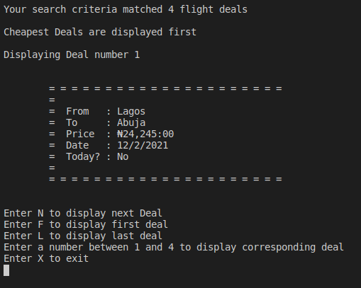

# Flights

A command line utility application written in Ruby to scrape selected website for the best flight deals of the day.



## How it works

Flights is highly configurable through command line arguments. It uses passed in options such as Location and Destination to filter search result scraped from web pages. The result is  sorted in ascending order of price, and user can navigate between them by issuing pre-connfigured commands.

## Built With

- Ruby

## Installation

Requirements:

- Ruby >= 2.7.2
- JRuby >= 9.2.0.0
- Nokogiri

Clone the repository to your local machine and run the application from it's root directory

```bash

  $ git clone git@github.com:chasscepts/flights.git
  $ cd <flights>
  $ bundle install # Only if you are developing and want to run tests and linters
  $ bin/main

```

## Command Line options

Flights currently accepts the following command line arguments

- `-from`  -  User Location. Searches will include only flights from location.
- `-to`   -  Flight Destination.
- `-today`  -  Include only today's flights

>Examples
```bash

  bin/main Lagos Abuja # Flights from Lagos to Abuja
  bin/main Lagos Abuja -today # Flights from Lagos to Abuja with take-off date of today
  bin/main -from Lagos -to Abuja -today # Same as above
  bin/main Abuja -today # Same as above (from defaults to Lagos)

```

## Testing
> Rspec is used for the test.
```bash
  $ rspec
```

## Author Details

👤 **Obetta Francis**

[](https://github.com/chasscepts) [](https://twitter.com/ofChass) [](https://www.linkedin.com/in/francis-obetta-4033b71bb/)

## 🤝 Contributing

Contributions, issues and feature requests are welcome!

Feel free to check the [issues page](https://github.com/chasscepts/flights/issues).

## Show your support

Give ⭐ Star me on GitHub — it helps!

## Acknowledgments

- Microverse Community.
- All whose codes were used

## 📝 License

This project is [MIT](./LICENSE) licensed.
